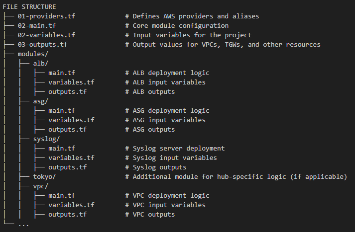

SOURCES

- https://docs.aws.amazon.com/prescriptive-guidance/latest/patterns/peer-vpcs-different-regions-transit-gateway.html
- https://docs.aws.amazon.com/vpc/latest/tgw/tgw-peering.html
- https://docs.aws.amazon.com/vpc/latest/tgw/tgw-peering-add-route.html
- https://registry.terraform.io/modules/plus3it/tardigrade-transit-gateway/aws/latest/submodules/cross-region-peering-attachment
- https://registry.terraform.io/providers/hashicorp/aws/latest/docs/resources/ec2_transit_gateway_vpc_attachment
- https://registry.terraform.io/modules/plus3it/tardigrade-transit-gateway-attachment/aws/latest
- https://registry.terraform.io/modules/plus3it/tardigrade-transit-gateway-attachment/aws/latest/submodules/cross-region-peering-attachment
- https://medium.com/@chinmay13/aws-networking-with-terraform-vpc-transit-gateway-between-vpcs-0721916ee2e0
- https://johnnymaclean.medium.com/terraform-aws-2-tier-architecture-e1fd11221bc3
- https://github.com/aws-samples/aws-transit-gateway-routing-lab
- https://github.com/aws-samples/aws-cdk-transit-gateway-peering
- https://stackoverflow.com/questions/78838728/aws-transit-gateway-why-propagate-routes-to-2-route-tables
- https://stackoverflow.com/questions/78555581/how-do-i-properly-set-up-a-cross-region-transit-gateway-route-with-terraform
- https://aiven.io/docs/platform/howto/attach-vpc-aws-tgw
- https://www.reddit.com/r/aws/comments/ynrm9k/transit_gateway_or_vpc_peering_for_crossregion/
- https://www.reddit.com/r/aws/comments/16vcxss/direct_connect_transit_gateway_attachment_best/
- https://www.reddit.com/r/aws/comments/x4878a/transit_gateways_shared_with_ram/

INDIVIDUAL AND GROUP 

Initial Project: sao_paulo_vpc_armageddon

Key Takeaways
  - Team members contributed individual region configurations be combined into the final project submission
    - Tokyo       =   10.100.0.0 (Julien): Completed in the combination of individual files
    - New York	  =   10.101.0.0 (Ester): https://github.com/EsterhitchensWAF/Armageddon-pipelineplumbs/tree/main
    - London		  =   10.102.0.0 (Julien): Completed in the combination of individual files
    - São Paulo	  =   10.103.0.0 (Adan): https://github.com/Agentadan/sao_paulo_vpc_armageddon AND (L): https://github.com/ldatareserve/armageddonplumbers/tree/main
    - Australia	  = 	10.104.0.0 (Jonathan): https://github.com/bigjon38/Australia_VPC_for_Armageddon
    - Hong Kong   =   10.105.0.0 (Cameron): https://github.com/CameronLCleveland/Hong-Kong
    - California  =	  10.106.0.0 (Marvin): https://github.com/kilik42/california_vpc_for_armageddon
      
  - Planning Session: https://www.youtube.com/watch?v=uhL5cqiJrXg&ab_channel=JulesofTech

  - Jules combined this into a complex Terraform configuration for multi-region VPCs connected via transit gateways, with Tokyo as the hub
    - Explanation Session: https://youtu.be/Fk3kJ5G5Wwo?si=4C-Aq7zRM7M3jcH7

  - The project demonstrates advanced AWS networking concepts and Terraform skills valuable for job interviews and real-world scenarios
  - Proper documentation (README files) for each component is crucial for explaining the project's architecture and functionality

Project Overview and Complexity

  - Multi-region AWS infrastructure with VPCs in Tokyo, New York, London, Sao Paulo, Australia, and California
  - Uses transit gateways to connect regions in a hub-and-spoke model with Tokyo as the hub
  - Includes ALB, ASG, syslog server, and complex routing configurations
  - Final Terraform configuration has over 100 resources and took significant debugging to get working properly

Technical Implementation Details

  - VPCs created for each region with public and private subnets
  - Transit gateways set up to connect regions privately
  - Peering attachments and acceptors configured to enable inter-region communication
  - Route tables updated to allow traffic flow between regions via transit gateways
  - Syslog server deployed in Tokyo to centralize logging

Terraform Configuration Challenges

  - Proper ordering of resource creation was crucial (VPCs, transit gateways, attachments, route tables)
  - Extensive use of depends_on to ensure correct resource creation order
  - Debugging issues with transit gateway availability and route propagation
  - Replacing default route table associations with custom ones for proper routing

Documentation and Presentation

  - Each team member created a README file explaining their individual region's configuration
  - Created a comprehensive README for the overall project, including:
      - Project purpose and architecture overview
      - Module descriptions (ALB, ASG, VPC, etc.)
      - Workflow and file structure explanations
      - Potential use cases and benefits of the infrastructure

Learning and Development

  - Project demonstrates significant growth in understanding AWS networking and Terraform
  - Valuable for explaining complex infrastructure designs in job interviews
  - Combines concepts from multiple previous projects into a production-like scenario

OVERALL PROJECT

TMMC-Teledoctor Multi-Region AWS Network Deployment

OVERVIEW

This Terraform configuration implements a multi-region AWS network architecture for the TMMC-Teledoctor project. The deployment consists of Virtual Private Clouds (VPCs) in multiple AWS regions, interconnected using Transit Gateways, and includes modules for Application Load Balancers (ALB), Auto Scaling Groups (ASG), Syslog Servers, and region-specific configurations.

The project is divided into reusable modules for flexibility and scalability, allowing the deployment to scale across different AWS regions with consistent patterns.

ROOT CONFIGURATION AND MODULES

PROVIDERS
The configuration specifies multiple AWS providers, each aliased to represent a specific AWS region:

- Tokyo (ap-northeast-1) - Hub region
- New York (us-east-1) - Spoke region
- London (eu-west-1) - Spoke region
- Sao Paulo (sa-east-1) - Spoke region
- Australia (ap-southeast-2) - Spoke region
- Hong Kong (ap-east-1) - Spoke region
- California (us-west-1) - Spoke region

MODULES
Each region deploys core infrastructure components using reusable modules stored in the modules/ directory:

1. VPC Module: Handles the creation of VPCs, subnets, route tables, and NAT Gateways for each region.
  - Public and private subnets are defined for each region.
  - Supports custom CIDR block allocation and private/public routes.
  - Ensures connectivity through Transit Gateways.
2. ALB Module: Deploys Application Load Balancers to handle incoming HTTP traffic.
  - Integrates with public subnets.
  - Configures target groups and listeners for forwarding traffic to application instances.
3. ASG Module: Creates Auto Scaling Groups with EC2 instances for application deployment.
  - Integrates with ALBs for dynamic scaling.
  - Configures health checks and security groups for instance management.
4. Syslog Module: Deploys a syslog server in the Tokyo hub region for centralized log collection.
  - Configures rsyslog for remote logging over UDP.
  - Protects traffic using security group rules.
5. Transit Gateway: Interconnects VPCs across regions.
  - Configures Transit Gateway attachments and route tables for hub-and-spoke architecture.
  - Manages inter-region communication via peering attachments.

Key Features
- Multi-Region Support: All modules are parameterized for deployment across different regions with custom configurations.
- Hub-and-Spoke Architecture: Tokyo serves as the central hub for all regional spokes.
- Centralized Logging: The syslog server in Tokyo aggregates logs from all regions.
- Scalable Design: ALBs and ASGs dynamically handle application traffic and compute requirements.
- Reusable Modules: Modularized infrastructure simplifies configuration management and promotes reusability.

FILE STRUCTURE
├── 01-providers.tf             # Defines AWS providers and aliases
├── 02-main.tf                  # Core module configuration
├── 02-variables.tf             # Input variables for the project
├── 03-outputs.tf               # Output values for VPCs, TGWs, and other resources
├── modules/
│   ├── alb/
│   │   ├── main.tf             # ALB deployment logic
│   │   ├── variables.tf        # ALB input variables
│   │   ├── outputs.tf          # ALB outputs
│   ├── asg/
│   │   ├── main.tf             # ASG deployment logic
│   │   ├── variables.tf        # ASG input variables
│   │   ├── outputs.tf          # ASG outputs
│   ├── syslog/
│   │   ├── main.tf             # Syslog server deployment
│   │   ├── variables.tf        # Syslog input variables
│   │   ├── outputs.tf          # Syslog outputs
│   ├── tokyo/                  # Additional module for hub-specific logic (if applicable)
│   ├── vpc/
│   │   ├── main.tf             # VPC deployment logic
│   │   ├── variables.tf        # VPC input variables
│   │   ├── outputs.tf          # VPC outputs
└── ...

WORKFLOW
- Define Providers: Providers are defined in 01-providers.tf with aliases for each region.
- Configure Regions: CIDR blocks, availability zones, and region-specific parameters are set in 02-main.tf.
- Deploy Modules: Each region deploys VPCs, ALBs, ASGs, and syslog components via reusable modules.
- Set Up Transit Gateways: Transit Gateways are configured in Tokyo as the hub and interconnected with spokes.
- Establish Routing: Route tables and peering attachments handle inter-region communication.
- Centralize Logging: The syslog server in Tokyo receives logs from all regions for centralized analysis.

OUTPUTS
The root module outputs key infrastructure details such as:
- Transit Gateway ARNs
- VPC IDs for each region
- ALB DNS names
- Syslog server IP addresses
- Space for Module-Specific Documentation

__________________________________
ALB MODULE
This module sets up Application Load Balancers (ALBs) in a specific region as part of the infrastructure. ALBs are used to distribute incoming application traffic (HTTP requests) to multiple backend servers (like EC2 instances). Here’s a breakdown of the module's components and how it works with the root configuration:

1. Purpose of This Module
The modules/alb module automates the deployment of:
- An Application Load Balancer (ALB): A service that receives incoming traffic and routes it to healthy backend servers.
- A Target Group: A group of backend servers (instances) that receive traffic from the ALB.
- A Listener: A configuration that defines how the ALB listens for incoming traffic and forwards it to the target group.
- It ensures high availability and scalability for the application deployed in each region.

2. Main Components
aws_lb (ALB Resource): 
- Creates the Application Load Balancer.
- It’s configured to handle public traffic (not internal) and is associated with:
- A security group: Defines inbound/outbound traffic rules.
- Public subnets: Where the ALB is deployed (provided by the root module for each region).
- Tags are added to identify resources (e.g., region_name-alb).
aws_lb_target_group (Target Group):
- Defines the backend servers (e.g., EC2 instances) that will receive traffic from the ALB.
- Configures a health check to monitor the availability of backend servers.
- Example: It pings / (root URL) on port 80 to verify server health.
- Tags are added for easy identification (e.g., region_name-tg).
aws_lb_listener (Listener):
- Configures how the ALB handles incoming HTTP traffic (on port 80).
- Forwards the traffic to the target group.

3. Variables Used in the Module
The module takes several inputs to customize the ALB setup for each region:
- region_name: Name of the region (e.g., Tokyo, New York).
- vpc_id: ID of the VPC where the ALB and target group operate.
- security_group_id: The security group for the ALB.
- public_subnet_ids: List of public subnet IDs where the ALB will be deployed.
- transit_gateway_id: The Transit Gateway ID (for future interconnectivity if needed).
- common_tags: Tags to apply to all resources for consistent identification.
- syslog_server_id: The syslog server's ID (to potentially forward logs in the future).

4. Outputs
The module provides two outputs to be used in other parts of the infrastructure:
- target_group_arn: The Amazon Resource Name (ARN) of the target group.
- This is used by other modules (e.g., Auto Scaling Groups) to attach EC2 instances to the target group.
- alb_dns_name: The DNS name of the ALB.
- This is used to route traffic to the ALB, such as when setting up DNS entries in Route 53.

5. Integration with Root Module
The root configuration ensures that this module works seamlessly with the overall infrastructure:
VPC and Subnet Integration:
- The root module defines VPCs and subnets for each region (e.g., Tokyo, New York).
- These are passed as inputs (vpc_id and public_subnet_ids) to the ALB module.
- Security Group: The root module defines security groups for each region and passes the ID (security_group_id) to the ALB.
- Transit Gateway: Although not directly used by the ALB, the root module ensures the ALB’s resources are aligned with the regional Transit Gateways for future expansion.
- Syslog Integration: The Tokyo region has a dedicated syslog server deployed via the syslog module. This ALB module accepts the syslog_server_id to integrate with the centralized logging system if needed.

6. Workflow
Here’s how the ALB module works in practice for a specific region:
- The root module calls the ALB module for a region (e.g., Tokyo).
- It passes required parameters such as vpc_id, public_subnet_ids, and security_group_id to deploy the ALB.
The module creates: 
- An ALB in public subnets.
- A target group for backend servers in the private subnets.
- A listener to route HTTP traffic to the target group.
- Outputs from this module are used by other modules (e.g., Auto Scaling Groups) to attach application servers.

7. Output
After deployment, the following outputs are available:
- ALB DNS Name: tokyo-alb-123456789.ap-northeast-1.elb.amazonaws.com
- Target Group ARN: arn:aws:elasticloadbalancing:ap-northeast-1:123456789:targetgroup/tokyo-tg/abc123
- These outputs are then used by the root module or other regional components, such as setting up DNS records in Route 53 or attaching Auto Scaling Groups.

ASG MODULE

This module is responsible for deploying Auto Scaling Groups (ASGs) in a specific AWS region. ASGs dynamically adjust the number of EC2 instances running in your environment to match traffic demands. They ensure high availability and efficient resource utilization by automatically adding or removing instances based on defined rules or conditions.

1. Purpose of This Module
The modules/asg module automates the creation and configuration of:

- A Launch Template: Specifies the configuration for the EC2 instances (e.g., operating system, instance type, networking, and startup scripts).
- An Auto Scaling Group: Manages the number of EC2 instances running based on defined minimum, maximum, and desired capacities.
- Associates the instances with a target group in the Application Load Balancer (ALB) for traffic routing.
- This setup ensures that your application can handle varying levels of traffic without manual intervention.

2. Main Components
a. aws_launch_template (Launch Template)
- A launch template is a blueprint for creating EC2 instances.
- This template includes: AMI (Amazon Machine Image): Specifies the operating system. This module uses Amazon Linux 2, fetched dynamically using the aws_ami data source.
- Instance Type: Defines the size and type of the instance (default is t3.micro but can be customized via instance_type).
Networking: 
- Disables public IP assignment for security.
- Associates the instance with the specified security group (security_group_id).
User Data:
- A startup script (passed as user_data) is executed when the instance launches.
- This script is a template file (user_data.sh.tpl) and includes region-specific configurations (e.g., syslog_server_ip).
- Tags: Adds identifying tags to the instances, including the region name.
b. aws_autoscaling_group (Auto Scaling Group)
The ASG manages the scaling of EC2 instances.
Key settings:
Capacity:
- Desired number of instances: 2.
- Minimum: 2.
- Maximum: 4.
- Target Group Association: Associates the instances with the Application Load Balancer’s target group (target_group_arn), so traffic is routed to these instances.
- Subnets: Deploys instances in the private subnets (private_subnet_ids) of the specified VPC.
- Health Check: Uses the Elastic Load Balancer (ELB) health check to ensure only healthy instances serve traffic.
- Launch Template: Tells the ASG to use the aws_launch_template created earlier.
- Tags: Adds identifying tags, including the region name.

3. Inputs (Variables Used)
The module requires several input variables to customize the ASG for each region:
- region_name: The name of the region (e.g., tokyo).
- vpc_id: The ID of the VPC where the ASG operates.
- syslog_server_id and syslog_server_ip: Details of the syslog server for logging.
- transit_gateway_id: The Transit Gateway ID (useful for interconnecting VPCs if needed).
- instance_type: The type of EC2 instances to launch (default: t3.micro).
- security_group_id: The security group that controls traffic for the instances.
- private_subnet_ids: The private subnets where instances are deployed.
- target_group_arn: The ALB target group that routes traffic to these instances.
- common_tags: A set of tags applied to all resources for identification.

4. Outputs
The module provides two outputs for integration with other parts of the infrastructure:
asg_name: 
- The name of the Auto Scaling Group.
- Useful for monitoring or integrating with other resources.
launch_template_id:
- The ID of the launch template used by the ASG.
- Can be used for auditing or debugging purposes.

5. Integration with the Root Module
This module is designed to work seamlessly with the root module:
- VPC and Subnet Integration: The root module creates the VPCs and subnets for each region (e.g., Tokyo, New York) and passes these as inputs to the ASG module (vpc_id and private_subnet_ids).
- ALB Target Group: The root module deploys an ALB using the modules/alb module and passes its target group ARN (target_group_arn) to the ASG module.
- Syslog Integration: In the Tokyo region, the root module deploys a syslog server using the modules/syslog module and passes its ID and IP to the ASG module.
- Tags: The root module defines common tags for all resources (e.g., project name, environment) and passes them to the ASG module for consistent resource tagging.

6. Workflow
The root module calls the ASG module for the Tokyo region with the following inputs:
- region_name: tokyo
- vpc_id and private_subnet_ids: Retrieved from the Tokyo VPC.
- target_group_arn: The ARN of the ALB’s target group in Tokyo.
- syslog_server_ip: The IP of the syslog server in Tokyo.
- common_tags: Standard tags for all resources.
- The module: Fetches the latest Amazon Linux 2 AMI using the aws_ami data source.
Creates a launch template with:
- The AMI ID.
- Instance type (e.g., t3.micro).
- Security group and network configuration.
- A startup script for syslog integration.
Creates an ASG to manage EC2 instances:
- Ensures at least 2 instances are running and scales up to 4 as needed.
- Associates the instances with the ALB’s target group.
- Deploys the instances in the Tokyo private subnets.
- The ASG dynamically adjusts the number of instances to handle changes in traffic.

7. Outputs
After deployment, the module provides:
- ASG Name: tokyo-web-asg
- Launch Template ID: lt-1234567890abcdef
- These outputs can be used for further integration, such as monitoring or scaling adjustments.

__________________________________
SYSLOG MODULE

This module is responsible for setting up a syslog server in an AWS environment. A syslog server is used to collect and store logs from various devices, servers, or applications for troubleshooting, monitoring, and auditing purposes.

1. Purpose of This Module
The modules/syslog module automates:
- Creating an EC2 Instance: This instance runs as a syslog server using the rsyslog service.
- Configuring the Syslog Server: The instance is set up to receive and store logs from other systems in the environment.
- Creating a Security Group: Ensures the syslog server can receive logs securely over the network using the UDP protocol on port 514.

2. Main Components
a. data "aws_ami" (Amazon Linux 2 Image)
- The module dynamically selects the latest Amazon Linux 2 AMI (Amazon Machine Image), which serves as the operating system for the EC2 instance.
Filters ensure the AMI:
- Is HVM (hardware virtual machine) compatible.
- Uses EBS (Elastic Block Store) for storage.
- Is in an available state.
- This ensures the syslog server runs on a stable, up-to-date, and efficient Linux operating system.
b. aws_instance "syslog" (Syslog EC2 Instance)
This resource creates the EC2 instance for the syslog server.
Key Attributes:
- AMI: The Amazon Linux 2 image identified earlier.
- Instance Type: t3.micro (a cost-effective, small-sized instance).
Networking:
- The instance is deployed in the specified subnet (var.subnet_id).
- The security group ensures controlled access to and from the instance.
User Data Script:
Configures the server to:
- Install and enable the rsyslog service.
Set up a configuration file (10-remote-logging.conf) that:
- Listens for incoming syslog messages on UDP port 514.
- Saves logs into a structured directory (/var/log/remote/<hostname>/<programname>.log).
- Create a directory (/var/log/remote) to store logs.
- Restart the rsyslog service to apply changes.
- Tags: Adds identifying tags like the project and environment name.
c. aws_security_group "syslog" (Security Group)
- This resource secures the syslog server by controlling network traffic.
- Ingress Rules: Allows incoming traffic on UDP port 514 from the specified VPC CIDRs (var.vpc_cidrs), enabling the syslog server to receive logs from systems within the VPC.
- Egress Rules: Allows the server to send traffic to any destination, which might be useful for updates or forwarding logs.
- Tags: Adds identifying tags for resource tracking and management.

3. Inputs (Variables Used)
The module uses several input variables to make it reusable for different regions and environments:
- vpc_id: The ID of the VPC where the syslog server will be deployed.
- subnet_id: The ID of the specific subnet where the syslog server will reside.
- vpc_cidrs: A map of CIDR blocks (IP ranges) allowed to send logs to the syslog server.
- common_tags: A set of tags (e.g., project name, environment) applied to all resources for easy identification and management.

4. Outputs
The module provides one key output:
- syslog_server_ip: The private IP address of the syslog server. This is essential for integrating other systems with the syslog server, as they need to know where to send their logs.

5. Integration with the Root Module
This module works seamlessly with the root module to provide a centralized logging solution:
- VPC and Subnet Integration: The root module creates the VPC and subnets for the region (e.g., Tokyo) and passes the appropriate vpc_id and subnet_id to the syslog module.
- ALB and ASG Integration: Other modules, such as modules/alb (Application Load Balancer) and modules/asg (Auto Scaling Group), can forward their logs to the syslog server using the syslog_server_ip output.
- Tags: The root module defines common_tags for all resources to ensure consistent identification and management across the infrastructure.

6. Workflow
The root module calls the syslog module with the following inputs:
- vpc_id: The ID of the Tokyo VPC.
- subnet_id: A private subnet ID in Tokyo.
- vpc_cidrs: CIDR blocks of all the VPCs in the environment, allowing them to send logs to the syslog server.
- common_tags: Standard tags for all resources.
- The syslog module: Deploys an EC2 instance in the specified subnet.
Installs and configures the rsyslog service to:
- Receive logs on UDP port 514.
- Organize logs by hostname and program name in /var/log/remote.
- Sets up a security group to allow UDP traffic on port 514 from the specified CIDR blocks.
- The syslog server is now ready to collect logs from systems in the Tokyo VPC and potentially other VPCs connected via a transit gateway.

7. Output
After deployment, the module provides:
- Syslog Server IP: 10.100.10.15 (for example).
- This IP is used by other systems to send their logs to the syslog server.

__________________________________
VPC MODULE

This module is responsible for creating a Virtual Private Cloud (VPC), along with its associated infrastructure, in AWS. A VPC is like a private network in AWS where resources such as EC2 instances, databases, and load balancers are deployed securely.

1. Purpose of This Module
The modules/vpc module automates:

- Creating a VPC: This is the main private network in AWS with custom CIDR blocks for IP address management.
- Setting Up Subnets: Divides the VPC into public and private subnets for organizing resources and controlling accessibility.
- Configuring Network Gateways: Adds Internet and NAT gateways for routing traffic within and outside the VPC.
- Defining Route Tables: Ensures proper traffic flow between resources in the VPC, public internet, and private networks.
- Configuring Security: Adds security groups for controlling access to resources.

2. Main Components
a. aws_vpc (Virtual Private Cloud)
Creates the VPC with:
- The specified CIDR block (var.vpc_cidr) for IP addresses.
- DNS support and DNS hostnames enabled for easier resource management.
- Tags are added for easy identification in AWS (e.g., project name, environment).
b. aws_subnet (Public and Private Subnets)
Public Subnets:
- Resources in these subnets, like load balancers, can connect to the internet.
- Public IPs are assigned to resources automatically (map_public_ip_on_launch = true).
Private Subnets:
- Resources here, like databases or backend servers, are not accessible directly from the internet.
- Both types of subnets are distributed across two availability zones for redundancy.
c. aws_internet_gateway
- Provides internet access for resources in the public subnets.
- This gateway connects the public subnets to the internet for tasks like receiving requests or downloading updates.
d. aws_nat_gateway
- Allows resources in private subnets to access the internet securely (e.g., for software updates) without exposing them to inbound traffic from the internet.
- NAT gateways are limited to two availability zones to balance cost and redundancy.
e. aws_route_table
- Public Route Table: Directs all traffic (0.0.0.0/0) from public subnets to the internet gateway, allowing public access.
- Private Route Table: Directs traffic from private subnets to the NAT gateway for outbound internet access.
f. aws_route_table_association
- Links subnets (public and private) to their respective route tables to ensure proper traffic flow:
- Public subnets are linked to the public route table.
- Private subnets are linked to the private route table.
g. aws_security_group
Creates a security group to control network access for web servers:
- Ingress Rules: Allows HTTP traffic (TCP port 80) from any IP address (0.0.0.0/0).
- Egress Rules: Allows all outbound traffic.
h. Dynamic NAT Gateway Map
- Logic: Only two NAT gateways are created for cost savings while maintaining redundancy.
- Mapping: A local variable (nat_gateway_map) dynamically calculates which availability zones will have NAT gateways.

3. Inputs (Variables Used)
The module is designed to be flexible and reusable with the following inputs:
- availability_zones: List of availability zones where the VPC and subnets will be created.
- region_name: Name of the region for tagging resources (e.g., Tokyo, New York).
- vpc_cidr: CIDR block for defining the IP address range of the VPC.
- extra_private_routes: Additional routes for private route tables, such as connections to transit gateways.
- common_tags: Key-value pairs for tagging resources consistently.

4. Outputs
The module provides these outputs for use in other modules:
- vpc_id: ID of the created VPC.
- private_subnet_ids: List of IDs for private subnets.
- public_subnet_ids: List of IDs for public subnets.
- nat_gateway_ids: List of IDs for the created NAT gateways.
- private_route_table_ids: ID of the private route table.
- security_group_id: ID of the security group for web servers.

5. Integration with the Root Module
This module works with the root configuration to set up networking in each AWS region:
- Input Variables: The root module provides the region-specific vpc_cidr, availability zones, and common tags.
- VPC Outputs: Outputs like vpc_id, subnet_ids, and security_group_id are used by other modules (e.g., ALB, ASG) for deploying resources within the VPC.
- Private Routes: The root module can define additional routes (extra_private_routes) for private subnets to connect to other networks like transit gateways.

6. Workflow
- Input from Root Module:
- vpc_cidr: 10.100.0.0/16 (Tokyo region).
- availability_zones: ["ap-northeast-1a", "ap-northeast-1c"].
- common_tags: Tags like project name and environment.
Module Execution:
- Creates a VPC with the specified CIDR block.
- Adds two public subnets (10.100.0.0/24, 10.100.1.0/24) and two private subnets (10.100.10.0/24, 10.100.11.0/24).
- Configures an internet gateway for public subnets.
- Adds two NAT gateways for private subnets.
- Sets up route tables to manage traffic flow.
- Output to Other Modules:
- The vpc_id is passed to modules like syslog, alb, and asg to deploy their resources within the same VPC.
- The private_subnet_ids and public_subnet_ids help assign resources to the correct subnets.

__________________________________
OVERALL VALUE

This architecture has valuable applications across multiple industries due to its robust global connectivity and centralized logging approach. Here are some practical examples:

1. Global Financial Services
  - Trading platforms requiring low-latency connections across major financial centers
  - Banking applications needing regional compliance with data residency requirements
  - Payment processing systems with global reach but regional data handling

2. Gaming Industry
  - Online multiplayer games requiring regional servers but global player interaction
  - Game analytics and user behavior tracking across regions
  - Content delivery and updates managed from a central hub

3. Healthcare (Beyond Telemedicine)
  - Global medical research collaboration platforms
  - Health data management systems with regional privacy compliance
  - Medical imaging sharing across international hospital networks

4. E-commerce
  - Global retail platforms with regional inventory management
  - International marketplace systems
  - Cross-border payment processing with regional compliance

5. Media and Entertainment
  - Global content streaming services
  - Regional content distribution networks
  - Live event broadcasting across multiple regions

6. Manufacturing and Supply Chain
  - Global supply chain management systems
  - International IoT device networks
  - Manufacturing execution systems across worldwide facilities

The key benefits that make this architecture valuable across industries are:
- Regional compliance handling
- Centralized monitoring and logging
- Disaster recovery capabilities
- Scalable regional deployment
- Consistent security controls
- Cost-effective global networking
